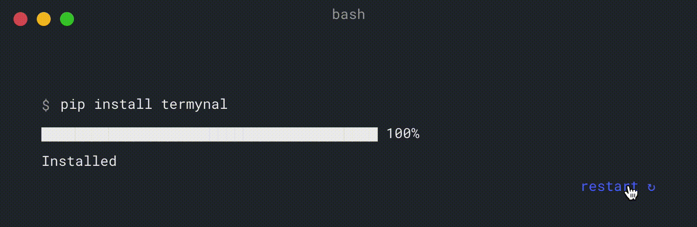

# Termynal


[](https://pypi.org/project/termynal/)
[](https://www.python.org/downloads/)
[](https://termynal.github.io/termynal.py/)


A lightweight and modern animated terminal window.
Built for [mkdocs](https://www.mkdocs.org/).

## Installation



[Examples](https://termynal.github.io/termynal.py/)

## Usage

Use `<!-- termynal -->` before code block

````
<!-- termynal -->

```
$ python script.py
```
````

### Mkdocs integration

Declare the plugin:

```yaml
...
plugins:
  - termynal
...
```

Optionally, pass options to the processor:

```yaml
[...]
plugins:
  - termynal:
      prompt_literal_start:
        - "$"
        - ">"
[...]
```

This config allows you to use another prompt:

````markdown
<!-- termynal -->

```
> pip install termynal
---> 100%
Installed
```

````

## Credits

Thanks [ines](https://github.com/ines/termynal)

## Contribution

[Contribution guidelines for this project](CONTRIBUTING.md)
