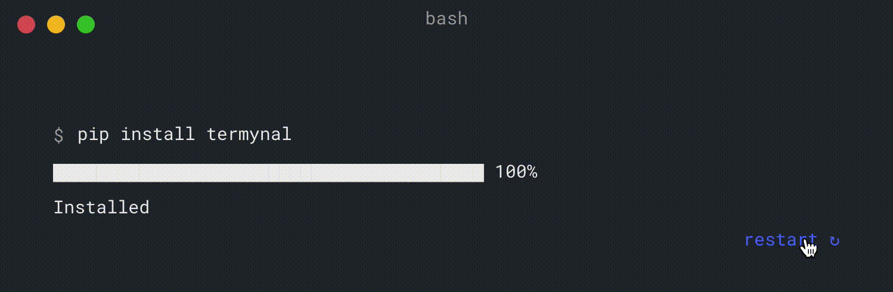

# Termynal


[](https://pypi.org/project/termynal/)
[](https://www.python.org/downloads/)
[](https://termynal.github.io/termynal.py/)


A lightweight and modern animated terminal window.
Built for [mkdocs](https://www.mkdocs.org/) and [zensical](https://zensical.org/).

## Installation



[Examples](https://termynal.github.io/termynal.py/)

## Usage

Use `<!-- termynal -->` before code block

````
<!-- termynal -->

```
$ python script.py
```
````

### Animation

Animation is enabled by default. To render a block instantly (no typing or
line delays), set `animate: false` on that block:

````markdown
<!-- termynal: animate: false -->

```
$ python script.py
```
````

You can also disable animation for every block by default and re-enable it on
individual blocks with `<!-- termynal: animate: true -->`. The default is set
in the plugin/extension config (see below).

### Mkdocs integration

Declare the plugin:

```yaml
...
plugins:
  - termynal
...
```

Optionally, pass options to the processor:

```yaml
[...]
plugins:
  - termynal:
      prompt_literal_start:
        - "$"
        - ">"
[...]
```

To turn off animation globally (each block can still opt back in with
`<!-- termynal: animate: true -->`):

```yaml
[...]
plugins:
  - termynal:
      animate: false
[...]
```

If you do not want to copy `termynal.css` and `termynal.js` as static files,
you can embed them directly in generated HTML:

```yaml
[...]
plugins:
  - termynal:
      include_assets: true
[...]
```

This config allows you to use another prompt:

````markdown
<!-- termynal -->

```
> pip install termynal
---> 100%
Installed
```

````

### Zensical integration

`zensical` does not support arbitrary MkDocs plugins yet, but it supports Python Markdown extensions.
Use `termynal` as a markdown extension and enable inline assets:

```toml
[project.markdown_extensions.termynal]
include_assets = true
title = "bash"
buttons = "macos"
prompt_literal_start = ["$"]
animate = true
```

You can override default assets with your own files:

```toml
[project.markdown_extensions.termynal]
include_assets = true
assets_override_css = "docs/stylesheets/termynal.css"
assets_override_js = "docs/javascripts/termynal.js"
```

For Zensical-style asset management, keep `include_assets = false` and register
assets explicitly:

```toml
[project]
extra_css = ["stylesheets/termynal.css"]
extra_javascript = ["javascripts/termynal.js"]

[project.markdown_extensions.termynal]
include_assets = false
```

## Credits

Thanks [ines](https://github.com/ines/termynal)

## Contribution

[Contribution guidelines for this project](CONTRIBUTING.md)
